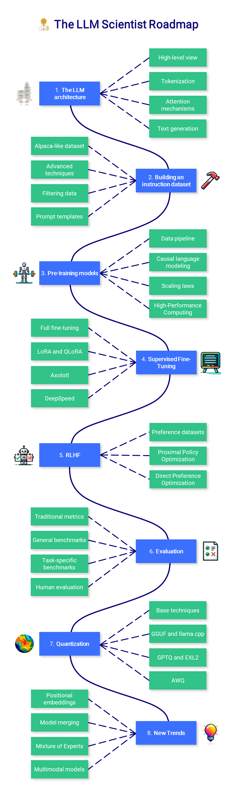

# LLM 学习笔记
 
<a href="https://github.com/mlabonne/llm-course/tree/main">Large Language Model Course</a>分享的学习课程，整理出来的中文版，希望对您有帮助~😀
 

  <h1>🧑‍💻 大模型学习课程</h1>
  

    📙 <a href="https://blog.csdn.net/weixin_49627776?spm=1000.2115.3001.5343">CSDN博客</a> 
  

 

Mlabonne大佬推荐以及贡献的课程分为三个部分:

1. 🧩 **LLM Fundamentals** 涵盖有关数学、Python 以及神经网络的基本知识
2. 🧑‍🔬 **The LLM Scientist** 专注于使用最新技术构建最好的 LLM
3. 👷 **The LLM Engineer** 重点介绍如何创建基于 LLM 的应用程序并进行部署

有意思的，对于课程的交互式版本，Mlabonne微调了两个 LLM 助手，它们将以个性化的方式回答你的问题：

* 🤗 [**HuggingChat Assistant**](https://hf.co/chat/assistant/66029d2e5f4a884f7aabc9d1): Mixtral-8x7B版本
* 🤖 [**ChatGPT Assistant**](https://chat.openai.com/g/g-yviLuLqvI-llm-course): ChatGPT版本

## 学习路线
## 🧩 第一部分 LLM 基础

介绍有关数学、Python 和神经网络的基本知识。您可能不需要从这里开始，但您可以参考它的学习路线，或者推荐给您的朋友。

## 🧑‍🔬 The LLM Scientist

这一部分课程侧重于学习如何使用最新技术构建 LLM

## 👷 The LLM Engineer

这部分课程侧重于学习如何构建可在实际生活中使用的 LLM 驱动的Agent，重点是增强模型并且部署

## 📝 分享有关学习笔记与文章

### 一些工具

| Notebook | Description | Notebook |
|----------|-------------|----------|
| 🧐 [LLM AutoEval](https://github.com/mlabonne/llm-autoeval) | 使用 RunPod 自动评估您的 LLM |  |
| 🥱 LazyMergekit | 使用 MergeKit 一键轻松合并模型 |  |
| 🦎 LazyAxolotl | 使用 Axolotl 一键微调模型 |  |
| ⚡ AutoQuant | 一键量化 GGUF、GPTQ、EXL2、AWQ 和 HQQ 格式的 LLM |  |
| 🌳 Model Family Tree | 可视化合并模型的family tree |  |
| 🚀 ZeroSpace | 使用免费的 ZeroGPU 自动创建 Gradio 聊天界面 |  |

### 微调教程

| Notebook | Description | Article | Notebook |
|---------------------------------------|-------------------------------------------------------------------------|---------------------------------------------------------------------------------------------|------------------------------------------------------------------------------------------------------------------------------------------------------|
| Fine-tune Llama 2 with QLoRA | 在 Google Colab 中监督微调 Llama 2 的分步指南 | [Article](https://mlabonne.github.io/blog/posts/Fine_Tune_Your_Own_Llama_2_Model_in_a_Colab_Notebook.html) |  |
| Fine-tune CodeLlama using Axolotl | 用于微调的最先进工具的端到端指南 | [Article](https://mlabonne.github.io/blog/posts/A_Beginners_Guide_to_LLM_Finetuning.html) |  |
| Fine-tune Mistral-7b with QLoRA | 在带有 TRL 的 Google Colab 中监督微调 Mistral-7b |  |  |
| Fine-tune Mistral-7b with DPO | 使用 DPO 提高受监督的微调模型的性能 | [Article](https://mlabonne.github.io/blog/posts/Fine_tune_Mistral_7b_with_DPO.html) |  |
| Fine-tune Llama 3 with ORPO | 使用 ORPO 在单个阶段进行更便捷、更快速的微调 | [Article](https://mlabonne.github.io/blog/posts/2024-04-19_Fine_tune_Llama_3_with_ORPO.html) |  |
| Fine-tune Llama 3.1 with Unsloth | Google Colab 中的超高效监督微调 | [Article](https://mlabonne.github.io/blog/posts/2024-07-29_Finetune_Llama31.html) |  |

### 量化教程

| Notebook | Description | Article | Notebook |
|---------------------------------------|-------------------------------------------------------------------------|---------------------------------------------------------------------------------------------|------------------------------------------------------------------------------------------------------------------------------------------------------|
| Introduction to Quantization | 使用 8 位量化优化大型语言模型 | [Article](https://mlabonne.github.io/blog/posts/Introduction_to_Weight_Quantization.html) |  |
| 4-bit Quantization using GPTQ | 量化您自己的开源 LLM，以便在消费类硬件上运行它们 | [Article](https://mlabonne.github.io/blog/4bit_quantization/) |  |
| Quantization with GGUF and llama.cpp | 使用 llama.cpp 量化 Llama 2 模型，并将 GGUF 版本上传到 HF Hub | [Article](https://mlabonne.github.io/blog/posts/Quantize_Llama_2_models_using_ggml.html) |  |
| ExLlamaV2: The Fastest Library to Run LLMs | 量化并运行 EXL2 模型，并将其上传到 HF Hub | [Article](https://mlabonne.github.io/blog/posts/ExLlamaV2_The_Fastest_Library_to_Run%C2%A0LLMs.html) |  |

### 其他教程

| Notebook | Description | Article | Notebook |
|---------------------------------------|-------------------------------------------------------------------------|---------------------------------------------------------------------------------------------|------------------------------------------------------------------------------------------------------------------------------------------------------|
| Decoding Strategies in Large Language Models | 从光速搜索到深度采样的文本生成指南 | [Article](https://mlabonne.github.io/blog/posts/2022-06-07-Decoding_strategies.html) |  |
| Improve ChatGPT with Knowledge Graphs | 用知识图谱增强 ChatGPT 的回答 | [Article](https://mlabonne.github.io/blog/posts/Article_Improve_ChatGPT_with_Knowledge_Graphs.html) |  |
| Merge LLMs with MergeKit | 轻松创建你自己的模型，无需 GPU！| [Article](https://mlabonne.github.io/blog/posts/2024-01-08_Merge_LLMs_with_mergekit%20copy.html) |  |
| Create MoEs with MergeKit | 将多个专家合并为一个 frankenMoE | [Article](https://mlabonne.github.io/blog/posts/2024-03-28_Create_Mixture_of_Experts_with_MergeKit.html) |  |
| Uncensor any LLM with abliteration | 无需重新训练即可进行微调 | [Article](https://mlabonne.github.io/blog/posts/2024-06-04_Uncensor_any_LLM_with_abliteration.html) |  |

---
## Acknowledgements

目前这还是不完整的学习笔记，推荐课程链接来自于<a href="https://github.com/mlabonne/llm-course/tree/main">Large Language Model Course</a>，后续会持续补充具体的学习内容~~🎄

*Disclaimer: I am not affiliated with any sources listed here.*

---

